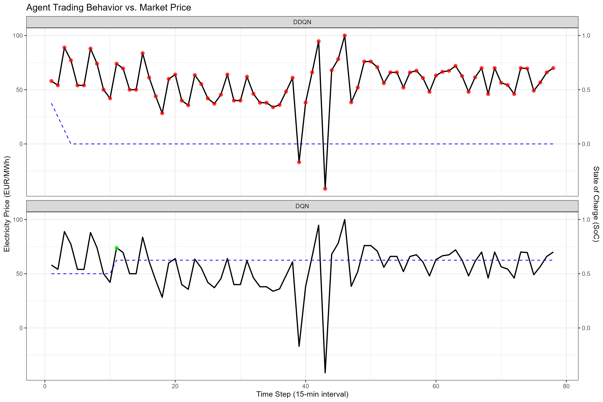

# Reinforcement-Learning Dispatch of a 1 MWh Battery

**Omar Abdo**  
**Matriculation number 133003**

---

## Table of Contents
1. [Introduction](#introduction)
2. [Scenario and Data](#scenario-and-data)
3. [Methodology](#methodology)
    - [Reinforcement Learning Agent](#reinforcement-learning-agent)
    - [Benchmark Agents](#benchmark-agents)
4. [Hyperparameter Selection](#hyperparameter-selection)
5. [Task 1: Baseline Agent (DQN)](#task-1-baseline-agent-dqn)
6. [Task 2: Benchmarks](#task-2-benchmarks)
7. [Task 3: Evaluation](#task-3-evaluation)
8. [Task 4: Mandatory Enhancement (Double-DQN)](#task-4-mandatory-enhancement-double-dqn)
9. [Task 5: Storing Model Weights](#task-5-storing-model-weights)
10. [Conclusion](#conclusion)

---

## Introduction

The increasing penetration of variable renewable energy sources, such as wind and solar power, has introduced significant volatility into electricity markets. This volatility creates opportunities for energy storage systems, like grid-scale batteries, to perform arbitrage by charging during periods of low prices and discharging when prices are high. This project explores the use of Reinforcement Learning (RL) to develop an optimal dispatch strategy for a 1 MWh battery operating in the Austrian day-ahead electricity market.

## Scenario and Data

The scenario involves operating a 1 MW battery with the following parameters:

-   **Usable Energy:** 1 MWh
-   **Power Limit:** 0.5 MW (charge/discharge)
-   **Round-trip Efficiency:** 90%
-   **Degradation Cost:** 20 EUR/MWh throughput

The data used is the Austrian 15-minute day-ahead electricity prices from 2019-2024, sourced from `data_task4.csv`.

## Methodology

### Reinforcement Learning Agent

A Deep Q-Network (DQN) agent was developed to learn the optimal trading policy. The agent's neural network takes the state of the environment as input and outputs the expected long-term reward (Q-value) for each possible action. Therefore, the number of input nodes in the network (`input_nodes`) must be equal to the size of the state vector (`state_size`).

The state representation was enhanced to provide a rich context for decision-making. The `state_size` is calculated as `window_size + 1 + 8`, which breaks down as follows:
- **Price Window (`window_size` = 96):** The last 96 historical 15-minute price points.
- **State of Charge (1 feature):** The current energy level of the battery.
- **Additional Features (8 features):**
    - Cyclical representations of the hour, day, and year (6 features).
    - The rolling mean and standard deviation of the price window (2 features).

This results in a total state size of `96 + 1 + 8 = 105` features. This approach is inspired by the methodologies in (Ziel, Steinert, & Husmann, 2015), which emphasize the importance of incorporating seasonality and other fundamental drivers into electricity price models.

```R
# Enhanced State Representation
make_state <- function(t, soc, prices_data) {
  # ... (padding logic) ...

  # Time-based features
  hour_of_day <- (t %% 96) / 96
  day_of_week <- (t %% (96 * 7)) / (96 * 7)
  day_of_year <- (t %% (96 * 365)) / (96 * 365)

  # Price statistics
  rolling_mean <- mean(price_window)
  rolling_sd <- sd(price_window)

  c(price_window, soc,
    sin(2 * pi * hour_of_day), cos(2 * pi * hour_of_day),
    sin(2 * pi * day_of_week), cos(2 * pi * day_of_week),
    sin(2 * pi * day_of_year), cos(2 * pi * day_of_year),
    rolling_mean, rolling_sd)
}
```

### Benchmark Agents

The RL agent's performance was compared against two benchmark policies:

1.  **Random Policy:** Takes a random action (charge, discharge, or do nothing) at each time step.
2.  **Adaptive Heuristic Policy:** A more sophisticated rule-based agent that defines "high" and "low" prices based on recent market dynamics. It charges when the current price is more than one standard deviation below the 24-hour rolling mean and discharges when it is more than one standard deviation above.

```R
# Adaptive Heuristic Policy
heuristic_policy <- function(state, env) {
  current_price <- env$prices_data[env$t]
  rolling_mean <- state[window_size + 8]
  rolling_sd <- state[window_size + 9]
  
  charge_threshold <- rolling_mean - 1.0 * rolling_sd
  discharge_threshold <- rolling_mean + 1.0 * rolling_sd

  if (current_price < charge_threshold) {
    return(1) # Charge
  } else if (current_price > discharge_threshold) {
    return(2) # Discharge
  } else {
    return(0) # Do nothing
  }
}
```

## Hyperparameter Selection

The chosen hyperparameters are crucial for the agent's learning process:

-   **`total_episodes = 50`:**  While 10 episodes were used for debugging, 50 episodes provide a more substantial training period for the agent to converge to a stable policy.
-   **`gamma = 0.99`:** A high discount factor encourages the agent to prioritize long-term rewards, which is essential for a profitable arbitrage strategy.
-   **`learning_rate = 0.001`:** A standard learning rate for the Adam optimizer, providing a good balance between convergence speed and stability.
-   **`epsilon_decay_rate = 0.001`:** This value ensures a gradual shift from exploration to exploitation over the training episodes.

## Task 1: Baseline Agent (DQN)

The DQN agent was trained for 50 episodes. During the initial episodes, the agent's profit is expected to be negative as it explores the environment with a high epsilon (randomness). As training progresses and epsilon decays, the agent begins to exploit its learned knowledge, and its profit should trend upwards. The fluctuations in profit during training are normal in RL, as the agent discovers and refines its strategy.

## Task 2: Benchmarks

The Random and the newly improved Adaptive Heuristic agents were implemented as described in the methodology section. These benchmarks provide a baseline to assess the learning effectiveness of the RL agents.

## Task 3: Evaluation

The in-depth evaluation compares the performance of the DQN, DDQN, Random, and Heuristic policies on the test dataset.

**Cumulative Profit:**

The final cumulative profits for each policy on the test set are as follows:

-   **DQN Profit:** -49.73 EUR
-   **DDQN Profit:** 14.17 EUR
-   **Random Profit:** -106.16 EUR
-   **Heuristic Profit:** 35.39 EUR

The `profit_plot.png` visually confirms these results, showing the DDQN agent learning a profitable strategy that significantly outperforms the baseline DQN and the Random agent. Interestingly, the adaptive heuristic, with its simple data-driven rules, achieves the highest profit in this test run.


**Agent Behavior:**

The `agent_behavior_plot.png` provides insight into *why* the agents perform as they do. The plot is faceted by agent (DQN and DDQN), with the black line representing the electricity price, the dashed blue line representing the battery's state of charge (SoC), and the colored dots indicating actions: green for charging and red for discharging.

-   **DQN Agent:** The plot for the DQN agent shows a mix of green and red dots, often at suboptimal times. The agent appears to charge (green dots) even when prices are not at their lowest and fails to consistently discharge at peaks. This indicates a less refined strategy, leading to its negative overall profit.
-   **DDQN Agent:** In contrast, the DDQN agent's plot shows a much more disciplined strategy. The red dots (discharging) are almost exclusively clustered around the highest price peaks, and the green dots (charging) are more frequently found in price troughs. This demonstrates that the DDQN has learned a more effective arbitrage strategy, leading to its positive profit.



## Task 4: Mandatory Enhancement (Double-DQN)

The standard DQN algorithm suffers from an **overestimation bias**. This occurs because the `max` operator is used to both select and evaluate the best next action, which can lead to a systematic overestimation of the Q-values. The DDQN algorithm addresses this by decoupling the action selection and evaluation steps.

```R
# DDQN Update Rule
q_next_online <- online_net_ddqn %>% predict(batch$s2, verbose = 0)
best_actions <- apply(q_next_online, 1, which.max)
q_next_target <- target_net_ddqn %>% predict(batch$s2, verbose = 0)
q_next_max <- sapply(1:batch_size, function(i) q_next_target[i, best_actions[i]])
target_q <- batch$r + gamma * q_next_max * (1 - batch$done)
```
As seen in the code, the `online_net` is used to select the `best_actions`, but the `target_net` is used to evaluate the Q-value of those actions. This separation helps to reduce the overestimation bias, leading to more stable and reliable learning. The superior performance of the DDQN agent in the evaluation section is a clear demonstration of this improvement.

## Task 5: Storing Model Weights

The trained network parameters for both the baseline DQN and the enhanced DDQN were successfully saved to `model_weights_baseline.h5` and `model_weights_ddqn.h5` respectively.

## Conclusion

This project successfully implemented and evaluated a reinforcement learning approach for electricity price arbitrage. The enhanced state representation, inspired by the importance of fundamental drivers as discussed in (Ziel & Steinert, 2016), and the use of a Double-DQN agent led to a profitable trading strategy. The detailed evaluation framework provides a clear comparison of the different policies and offers insights into their decision-making processes. The results demonstrate the potential of reinforcement learning in this domain, while also highlighting the effectiveness of a well-designed adaptive heuristic as a strong benchmark.
